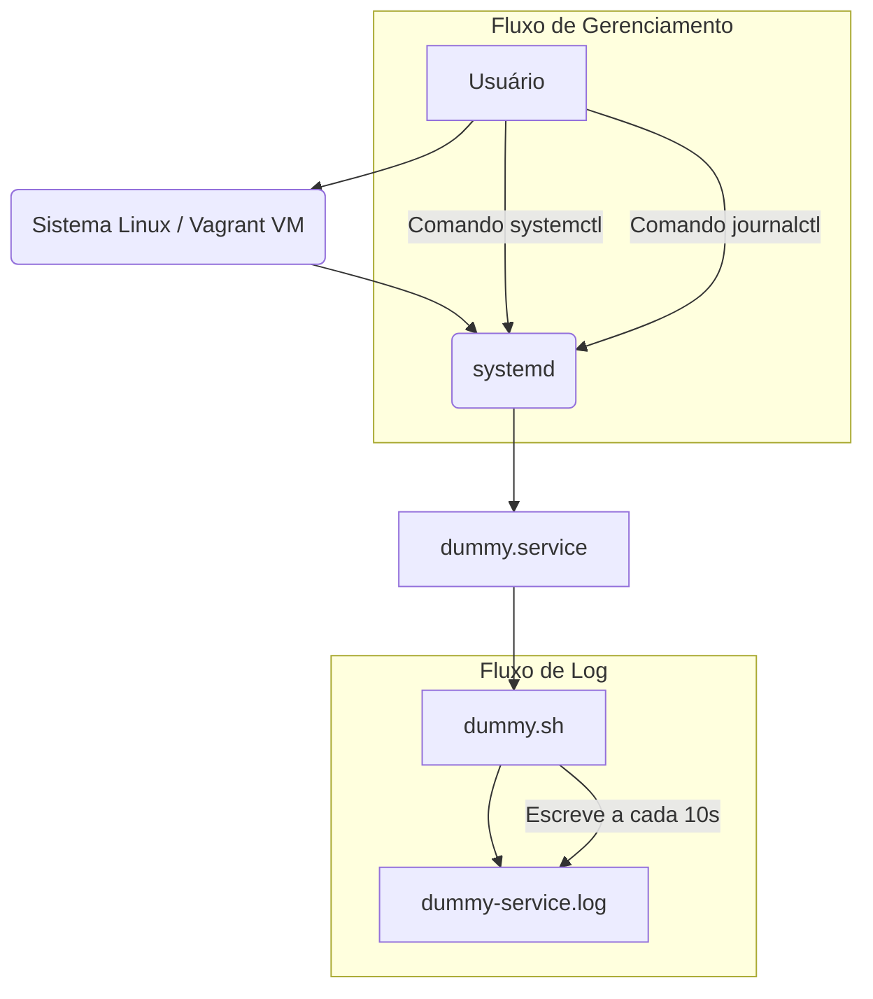

`Linux` `DevOps` `Systemd`

# 🚀 Projeto: Serviço Systemd Fictício (Dummy Systemd Service)

## 🎯 Objetivo

O objetivo deste projeto é familiarizar-se com o `systemd`, o gerenciador de sistema e serviços padrão na maioria das distribuições Linux modernas. Através da criação e gerenciamento de um serviço fictício (`dummy.service`), você aprenderá a:

-   Criar um script de longa duração em `bash`.
-   Definir um arquivo de unidade (`.service`) para o `systemd`.
-   Configurar o serviço para iniciar automaticamente na inicialização do sistema.
-   Garantir a reinicialização automática do serviço em caso de falha.
-   Monitorar o status e os logs do serviço usando `systemctl` e `journalctl`.
-   Dockerizar um serviço Linux, demonstrando portabilidade e resiliência.

Este projeto solidifica as habilidades fundamentais de gerenciamento de serviços em ambientes Linux, essenciais para qualquer profissional de DevOps.

---

## 🏛️ Arquitetura Proposta

O diagrama a seguir ilustra a arquitetura do serviço fictício e como ele se integra ao `systemd` e ao sistema de logging.



**Explicação:**
-   **Usuário:** Interage com o sistema (VM Vagrant ou host Linux) usando comandos `systemctl` e `journalctl`.
-   **Sistema Linux / Vagrant VM:** O ambiente de execução para o `systemd` e o serviço.
-   **systemd:** O sistema init que gerencia o ciclo de vida do `dummy.service`.
-   **dummy.service:** O arquivo de configuração do `systemd` que define como o script `dummy.sh` deve ser executado, com reinício automático e logging para o `journald`.
-   **dummy.sh:** O script `bash` que simula a carga de trabalho, gravando mensagens com timestamp a cada 10 segundos.
-   **dummy-service.log:** Um arquivo de log físico onde o `dummy.sh` também escreve, demonstrando a coexistência de logs via `journald` e logs de arquivos.

---

## 🧠 Justificativa das Decisões Técnicas

1.  **systemd como Gerenciador de Serviços:** A escolha do `systemd` é estratégica, pois ele é o padrão da indústria em distribuições Linux modernas. Utilizá-lo garante que o serviço será gerenciado de forma robusta, com inicialização automática no boot, supervisão e reinicialização em caso de falha, cobrindo aspectos cruciais de confiabilidade em sistemas de produção.
2.  **Script `dummy.sh`:** Um script `bash` simples é empregado para simular um processo de longa duração. A simplicidade permite focar no gerenciamento do `systemd` sem complexidades de aplicação, enquanto o loop `while true` e `sleep` mimetizam um serviço contínuo que realiza tarefas periódicas.
3.  **Configuração `Restart=always`:** Essencial para a resiliência do serviço. Se o `dummy.sh` for encerrado inesperadamente (por falha, erro ou intervenção externa), o `systemd` garantirá que ele seja reiniciado automaticamente, minimizando o tempo de inatividade.
4.  **Logging para `journald` (`StandardOutput=journal`):** A prática recomendada em `systemd` é direcionar `stdout` e `stderr` para o `journald`. Isso centraliza os logs do sistema, permitindo que sejam consultados, filtrados e analisados eficientemente usando `journalctl`. O script também escreve em um arquivo de log direto (`/var/log/dummy-service.log`) para ilustrar cenários onde aplicações mantêm seus próprios logs, embora a principal observabilidade do serviço seja via `journald`.
5.  **Dockerização para Portabilidade e Padrão do Lab:** Embora `systemd` seja intrinsecamente ligado ao host Linux, a dockerização é um requisito obrigatório no DevOps Master Lab. Para isso, foi adotada uma abordagem onde o contêiner executa diretamente o `dummy.sh` como seu processo principal (`CMD`). O `docker-compose.yml` então usa `restart: always` para emular o comportamento de resiliência do `systemd` para o contêiner. Esta abordagem destaca a capacidade de empacotar e executar serviços com dependências de ambiente em um formato portátil, mesmo que a execução nativa do `systemd` dentro de um contêiner não seja a prática mais comum ou eficiente. Ela também prepara o projeto para integração futura em pipelines de CI/CD.

---

## 🛠️ Como Utilizar o Projeto

### Pré-requisitos

-   Sistema Linux (preferencialmente Debian ou Ubuntu) com `systemd` instalado.
-   Docker e Docker Compose instalados.
-   VM Vagrant configurada (conforme `DevOps_Master_Lab`).

### 1. Execução Via `systemd` (Na VM Vagrant ou Host Linux)

1.  **Copie o arquivo de unidade:**
    Transfira o arquivo `dummy.service` para o diretório de serviços do `systemd`. Você pode fazer isso copiando-o para `/etc/systemd/system/`:
    ```bash
    sudo cp projects/01-foundations/02-dummy-systemd-service/config/dummy.service /etc/systemd/system/
    ```

2.  **Recarregue o `systemd`:**
    Após adicionar ou modificar um arquivo de unidade, o `systemd` precisa recarregar sua configuração:
    ```bash
    sudo systemctl daemon-reload
    ```

3.  **Habilite o serviço (para iniciar no boot):**
    ```bash
    sudo systemctl enable dummy
    ```

4.  **Inicie o serviço:**
    ```bash
    sudo systemctl start dummy
    ```

5.  **Verifique o status do serviço:**
    ```bash
    sudo systemctl status dummy
    ```
    Você deverá ver que o serviço está `active (running)`.

6.  **Monitore os logs:**
    ```bash
    sudo journalctl -u dummy -f
    ```
    Este comando mostrará os logs do seu serviço em tempo real. Você deverá ver as mensagens "Dummy service is running..." aparecendo a cada 10 segundos.

7.  **Verifique o arquivo de log direto (opcional):**
    ```bash
    tail -f /var/log/dummy-service.log
    ```
    Você também verá as mensagens neste arquivo.

8.  **Para parar o serviço:**
    ```bash
    sudo systemctl stop dummy
    ```

9.  **Para desabilitar o serviço (remover do boot):**
    ```bash
    sudo systemctl disable dummy
    ```

### 2. Execução Via Docker Compose

1.  **Navegue até a raiz do projeto:**
    ```bash
    cd projects/01-foundations/02-dummy-systemd-service/
    ```

2.  **Inicie o serviço com Docker Compose:**
    ```bash
    docker compose up -d
    ```
    -   `docker compose up`: Constrói a imagem (se necessário) e inicia os contêineres definidos no `docker-compose.yml`.
    -   `-d`: Executa os contêineres em modo "detached" (em segundo plano).

3.  **Verifique o status do contêiner:**
    ```bash
    docker ps -f name=dummy-service-container
    ```
    Você deverá ver o contêiner `dummy-service-container` em estado `Up`.

4.  **Monitore os logs do contêiner:**
    ```bash
    docker logs -f dummy-service-container
    ```
    Este comando exibirá os logs gerados pelo script `dummy.sh` que são redirecionados para o `stdout` do contêiner.

5.  **Para parar e remover o serviço Docker Compose:**
    ```bash
    docker compose down
    ```

---

## 💡 Lições Aprendidas

-   **Gerenciamento de Serviços com `systemd`**: Compreensão profunda da criação, configuração e interação com serviços via `systemctl`, incluindo a importância de `ExecStart`, `Restart=always` e `WantedBy`.
-   **Logging e Observabilidade**: A importância de direcionar logs para o `journald` para centralização e análise eficiente, e a capacidade de monitorar serviços em tempo real com `journalctl -f`.
-   **Resiliência e Alta Disponibilidade**: A configuração `Restart=always` é um pilar para garantir que os serviços se recuperem automaticamente de falhas, crucial em ambientes de produção.
-   **Contêinerização vs. Gerenciamento de Serviços em Host**: Entendimento das diferenças e escolhas arquiteturais ao decidir entre executar um serviço diretamente no host (`systemd`) ou empacotá-lo em um contêiner (Docker), e como simular comportamentos de resiliência em ambos.
-   **Padrões de Projeto DevOps**: Aplicação da estrutura de diretórios (`app/`, `config/`), uso de `.gitignore` para higiene do repositório, e documentação detalhada (`README.md`) para facilitar a reprodutibilidade e a compreensão do projeto.

---

## 💖 Apoie este Projeto Open Source

Se você gosta dos meus projetos, considere:
- 🏆 Me indicar para o GitHub Stars [Indicar Aqui](https://stars.github.com/nominate/)
- ⭐ Dar uma estrela nos repositórios
- 🐛 Reportar bugs ou melhorias
- 🤝 Contribuir com código

---

## ⚖️ Licença

Distribuído sob a licença **Apache 2.0**. Esta licença oferece permissão para uso, modificação e distribuição, além de garantir proteção contra disputas de patentes para colaboradores e usuários. Veja o arquivo [LICENSE](LICENSE) para mais informações.

---

This project is part of [roadmap.sh](hhttps://roadmap.sh/projects/dummy-systemd-service) DevOps projects.
