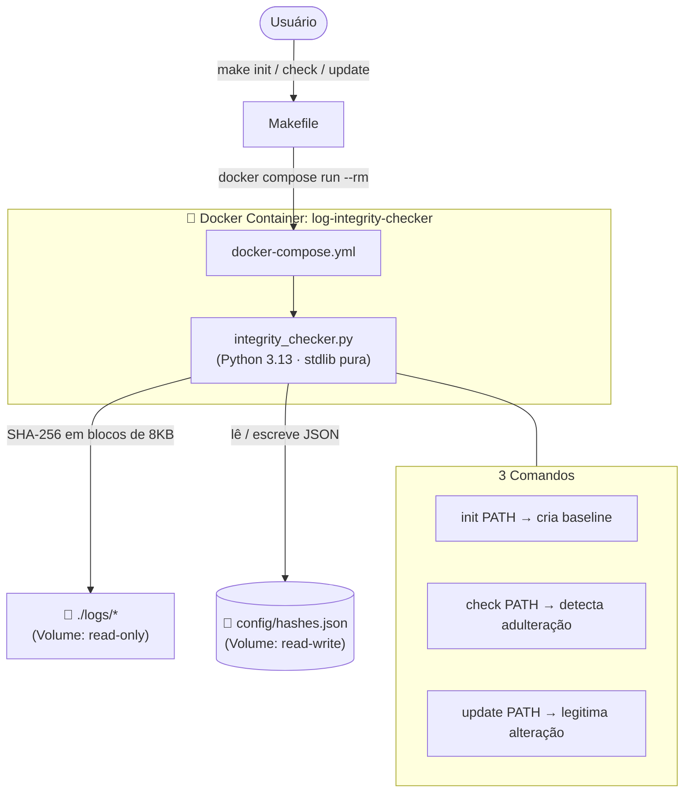

`Linux` `Python` `Docker` `Security` `SHA-256`

# 🔐 Projeto: Verificador de Integridade de Arquivos de Log

Ferramenta CLI para detectar adulterações em arquivos de log via hashing criptográfico SHA-256. Cria um baseline de hashes na primeira execução e, nas seguintes, compara para identificar qualquer modificação não autorizada.

---

## 🏛️ Arquitetura



---

## 🧠 Justificativa das Decisões Técnicas

| Decisão | Escolha | Justificativa |
|---|---|---|
| **Linguagem** | Python 3.13 | `hashlib`, `pathlib`, `argparse` são stdlib — zero dependências externas para instalar |
| **Algoritmo** | SHA-256 | Padrão da indústria aprovado pelo NIST; resistente a colisões; rápido o suficiente para arquivos de log |
| **Persistência** | JSON (`config/hashes.json`) | Human-readable e auditável por qualquer editor de texto, sem banco de dados |
| **Chaves do JSON** | `str(Path.resolve())` | Paths absolutos dentro do container evitam ambiguidade entre execuções com CWD diferente |
| **Exit codes** | `sys.exit(1)` em adulteração | Permite integração direta com pipelines CI/CD e scripts Bash (`if make check; then ...`) |
| **Runtime** | Docker (execution wrapper) | Garante Python 3.13 consistente em qualquer host sem instalar nada além do Docker |
| **Volumes** | `./logs` (ro) + `./config` (rw) | Princípio de menor privilégio — o verificador lê logs mas jamais os modifica |
| **User flag** | `--user $(id -u):$(id -g)` | O container herda o UID/GID do host, evitando conflito de permissão nos volumes montados |

---

## 📋 Pré-requisitos

| Ferramenta | Versão mínima | Verificar |
|---|---|---|
| Docker | 24+ | `docker --version` |
| Docker Compose | v2 (plugin) | `docker compose version` |
| Make | qualquer | `make --version` |

---

## 🚀 Guia de Execução

### 1. Clone e navegue até o projeto

```bash
git clone https://github.com/nilo-lima/devops-master-lab
cd DevOps_Master_Lab/projects/01-foundations/03-log-integrity-checker
```

### 2. Construa a imagem Docker

```bash
make build
```

### 3. Inicialize o baseline de hashes

```bash
make init
# ou para um arquivo específico:
make init LOGS_PATH=/logs/app.log
```

### 4. Verifique a integridade

```bash
make check
```

### 5. Após uma alteração legítima, atualize o hash

```bash
make update LOGS_PATH=/logs/app.log
```

### 6. Reinicializar do zero

```bash
make reset && make init
```

### 7. Demo completo (fluxo automatizado)

```bash
make test
```

---

## 🎬 Demonstração

Saída real do `make test`:

```
==========================================
 DEMO: Fluxo Completo de Integridade
==========================================

--- Passo 1: Inicializando baseline de hashes ---
Hashes armazenados com sucesso. 3 arquivo(s) registrado(s).

--- Passo 2: Verificação inicial (esperado: OK) ---

Relatório de Verificação de Integridade:
-------------------------------------------------------
  [OK]         /logs/app.log
  [OK]         /logs/auth.log
  [OK]         /logs/system.log
-------------------------------------------------------
Status: ÍNTEGRO

--- Passo 3: Simulando adulteração em logs/app.log ---

--- Passo 4: Verificação pós-adulteração (esperado: MODIFICADO) ---

Relatório de Verificação de Integridade:
-------------------------------------------------------
  [MODIFICADO] /logs/app.log
  [OK]         /logs/auth.log
  [OK]         /logs/system.log
-------------------------------------------------------
Status: ADULTERAÇÃO DETECTADA

--- Passo 5: Restaurando arquivo original (byte-a-byte) ---

--- Passo 6: Verificação final (esperado: OK) ---

Relatório de Verificação de Integridade:
-------------------------------------------------------
  [OK]         /logs/app.log
  [OK]         /logs/auth.log
  [OK]         /logs/system.log
-------------------------------------------------------
Status: ÍNTEGRO
```

---

## 📁 Estrutura do Projeto

```text
03-log-integrity-checker/
├── app/
│   └── integrity_checker.py   # CLI Python: init | check | update
├── config/
│   ├── .gitkeep               # Garante que o diretório existe no git
│   └── hashes.json            # Gerado em runtime (gitignored)
├── logs/
│   ├── app.log                # Log de demonstração
│   ├── auth.log               # Log de demonstração
│   └── system.log             # Log de demonstração
├── Dockerfile                 # Python 3.13-slim, user não-root
├── docker-compose.yml         # Volumes: logs (ro) + config (rw)
├── Makefile                   # init | check | update | reset | test | clean
├── .gitignore                 # Exclui hashes.json e artefatos de runtime
└── README.md                  # Este arquivo
```

---

## 💡 Resultados de Aprendizagem

- **Hashing criptográfico:** SHA-256 processa o arquivo em blocos de 8KB (`iter(lambda: f.read(8192), b"")`), sendo eficiente para arquivos grandes sem carregar tudo na memória.
- **File Integrity Monitoring (FIM):** Padrão de segurança usado em ferramentas como AIDE, Tripwire e Wazuh — este projeto reproduz o conceito core dessas ferramentas.
- **Exit codes como contrato:** `sys.exit(1)` em adulteração transforma a ferramenta em um componente composável — scripts Bash e pipelines CI/CD podem reagir à sua saída automaticamente.
- **Docker como execution wrapper:** Para CLIs que não precisam de rede ou estado longo, `docker compose run --rm` é o padrão ideal — executa, entrega o resultado e remove o container.
- **Princípio de menor privilégio em volumes:** Montar `./logs` como `:ro` (read-only) é uma defesa em profundidade — mesmo que o container seja comprometido, não poderá alterar os logs que está verificando.

---

## 🗺️ Próximos Passos

- [ ] **Suporte a HMAC:** Assinar o `hashes.json` com uma chave secreta para garantir que o próprio banco de hashes não foi adulterado.
- [ ] **Modo watch:** Monitoramento contínuo com `inotify` ou polling periódico, emitindo alertas em tempo real.
- [ ] **Integração CI/CD:** Executar `make check` como step de pipeline para bloquear deployments se logs de auditoria forem alterados.
- [ ] **Saída estruturada:** Flag `--format json` para consumo por ferramentas de observabilidade (Grafana Loki, Elasticsearch).
- [ ] **Múltiplos algoritmos:** Suporte a `--algo sha512` ou `--algo blake2b` para cenários que exigem algoritmos mais robustos.

---

## 💖 Apoie este Projeto Open Source

Se você gosta dos meus projetos, considere:
- 🏆 Me indicar para o GitHub Stars [Indicar Aqui](https://stars.github.com/nominate/)
- ⭐ Dar uma estrela nos repositórios
- 🐛 Reportar bugs ou melhorias
- 🤝 Contribuir com código

---

## ⚖️ Licença

Distribuído sob a licença **Apache 2.0**. Esta licença oferece permissão para uso, modificação e distribuição, além de garantir proteção contra disputas de patentes para colaboradores e usuários.

---

This project is part of [roadmap.sh](https://roadmap.sh/projects/file-integrity-checker) DevOps projects.
