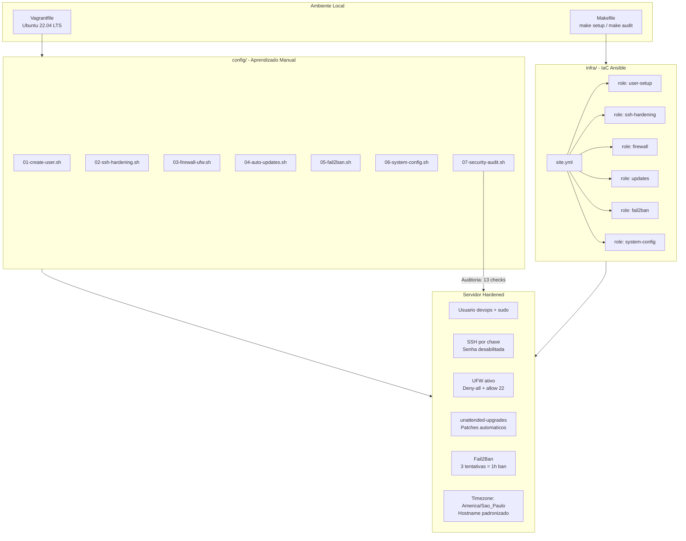

<div align="center">

# 🔐 Linux Server Setup

**Hardening de servidor Ubuntu do zero: do root ao production-ready em minutos.**


</div>

---

## 📋 Sobre o Projeto

Projeto de hardening completo para servidores Ubuntu, cobrindo as 9 camadas de segurança exigidas para ambientes de produção. Vai além do tutorial original ao transformar cada etapa manual em um **Ansible Role** reutilizavel, tornando o setup 100% reproduzivel via IaC.

| Funcionalidade | Ferramenta | Descricao |
|:---------------|:-----------|:----------|
| Gestao de usuarios | `useradd` / Ansible | Usuario nao-root com sudo, senha expirada no 1o login |
| Hardening SSH | `sshd_config` | Desabilita senha, limita tentativas, configura timeouts |
| Firewall | UFW | Politica deny-all, libera apenas portas autorizadas |
| Atualizacoes automaticas | `unattended-upgrades` | Patches de seguranca aplicados sem intervencao humana |
| Prevencao de brute-force | Fail2Ban | Ban de 1h apos 3 tentativas SSH falhas |
| Configuracao do sistema | `timedatectl` / `hostnamectl` | Timezone e hostname padronizados |
| Gerenciamento de servicos | `systemctl` | Habilitacao e monitoramento de servicos criticos |
| Auditoria | Script Bash customizado | Smoke test verificando todas as 9 configuracoes |
| IaC - Automacao total | Ansible Playbook | Reproduce o hardening completo em qualquer servidor Ubuntu |

---

## 🏗️ Arquitetura

### Arvore de Diretorios

```text
04-linux-server-setup/
├── config/
│   ├── 01-create-user.sh          # Cria usuario nao-root com sudo
│   ├── 02-ssh-hardening.sh        # Hardeniza sshd_config com backup
│   ├── 03-firewall-ufw.sh         # UFW: deny-all + allow SSH
│   ├── 04-auto-updates.sh         # unattended-upgrades configurado
│   ├── 05-fail2ban.sh             # Fail2Ban com jail SSH customizado
│   ├── 06-system-config.sh        # Timezone + Hostname
│   └── 07-security-audit.sh       # Smoke test: verifica todas as configs
├── infra/
│   ├── site.yml                   # Playbook Ansible principal
│   ├── inventory.ini              # Inventario (Vagrant / remoto)
│   └── roles/
│       ├── user-setup/            # Role: gestao de usuarios
│       ├── ssh-hardening/         # Role: hardening SSH
│       ├── firewall/              # Role: UFW
│       ├── updates/               # Role: atualizacoes automaticas
│       ├── fail2ban/              # Role: protecao brute-force
│       └── system-config/         # Role: timezone e hostname
├── Vagrantfile                    # VM Ubuntu 22.04 LTS para testes
├── Makefile                       # Controle remoto do ambiente
├── .gitignore                     # Guardrails: bloqueia chaves e logs
└── README.md
```

### Diagrama de Fluxo



---

## 🧠 Justificativa das Decisoes Tecnicas

**ADR-01: Scripts Bash individuais por etapa**

Cada configuracao de seguranca vive em um script isolado e comentado. A alternativa seria um unico script monolitico, mas a abordagem modular permite executar, debugar e entender cada etapa independentemente - essencial para o aprendizado e para troubleshooting em producao.

**ADR-02: Ansible com estrutura de Roles**

O playbook segue a estrutura canonica de roles ao inves de um playbook flat. Isso garante reusabilidade (cada role pode ser aplicada a outros projetos), separacao de responsabilidades e sobrescrita de variaveis por ambiente via `defaults/main.yml`.

**ADR-03: Vagrant com Ubuntu 22.04 LTS**

Ubuntu 22.04 LTS (Jammy) e o target padrao de servidores em producao com suporte ate 2027. O Vagrant isola os testes do sistema operacional do host, eliminando o risco de aplicar configuracoes incorretas na maquina local.

**ADR-04: sshd_config com hardening alem do basico**

Alem de desabilitar autenticacao por senha, aplicamos: `MaxAuthTries 3` (limita tentativas), `LoginGraceTime 30` (encerra conexoes ociosas no login), `ClientAliveInterval 300` (detecta sessoes mortas) e `X11Forwarding no` (elimina vetor de ataque grafico). O sshd_config original e preservado em backup automatico.

**ADR-05: Fail2Ban com jail customizado**

A configuracao padrao do Fail2Ban e permissiva (`maxretry=5`, `bantime=10min`). Adotamos valores mais agressivos: 3 tentativas resultam em ban de 1 hora. O `backend=systemd` garante compatibilidade com Ubuntu 22.04 que usa journald como backend de logs.

**ADR-06: Script de auditoria como smoke test**

O `07-security-audit.sh` verifica programaticamente as 13 configuracoes esperadas e retorna exit code 1 em caso de falha. Isso permite integrar a auditoria em pipelines CI/CD futuros com `make audit`.

**ADR-07: unattended-upgrades restrito a patches de seguranca**

Configuramos o `Allowed-Origins` para aceitar apenas `${distro_codename}-security`, evitando que atualizacoes de pacotes nao-criticos causem instabilidade em servicos de producao. `Automatic-Reboot: false` garante que reboots sejam agendados manualmente.

---

## 🚀 Guia de Execucao

### Pre-requisitos

| Ferramenta | Versao minima | Verificacao |
|:-----------|:-------------|:------------|
| Vagrant | 2.3+ | `vagrant --version` |
| VirtualBox | 6.1+ | `vboxmanage --version` |
| Ansible | 2.14+ | `ansible --version` |
| ansible-lint (opcional) | 6.0+ | `ansible-lint --version` |

### Opcao 1: Execucao via Makefile (Recomendado)

```bash
# A partir do diretorio do projeto
cd projects/01-foundations/04-linux-server-setup

# 1. Sobe a VM Ubuntu 22.04
make up

# 2. Executa o playbook completo de hardening
make setup

# 3. Valida todas as configuracoes de seguranca
make audit

# 4. (Opcional) Valida sintaxe do playbook
make lint

# Ao finalizar os testes
make down   # desliga a VM
make clean  # destroi a VM
```

### Opcao 2: Scripts Bash (Aprendizado manual na VM)

```bash
# Acessa a VM
vagrant ssh

# Dentro da VM, execute cada script na ordem:
sudo bash /vagrant/config/01-create-user.sh devops
sudo bash /vagrant/config/02-ssh-hardening.sh
sudo bash /vagrant/config/03-firewall-ufw.sh
sudo bash /vagrant/config/04-auto-updates.sh
sudo bash /vagrant/config/05-fail2ban.sh
sudo bash /vagrant/config/06-system-config.sh "America/Sao_Paulo" "lab-server"

# Verifica resultado
sudo bash /vagrant/config/07-security-audit.sh
```

### Opcao 3: Ansible contra servidor remoto

```bash
# Edite o inventario com o IP do servidor remoto
vim infra/inventory.ini

# Execute o playbook
cd infra
ansible-playbook -i inventory.ini site.yml --ask-become-pass
```

### Targets do Makefile

| Target | Descricao |
|:-------|:----------|
| `make up` | Sobe a VM Ubuntu 22.04 LTS via Vagrant |
| `make down` | Desliga a VM (preserva o estado do disco) |
| `make clean` | Destroi a VM completamente |
| `make setup` | Executa o playbook Ansible de hardening completo |
| `make audit` | Roda o smoke test de seguranca dentro da VM |
| `make lint` | Valida a sintaxe do playbook com ansible-lint |

---

## 📈 Proximos Passos

- [ ] Adicionar role `ntp` para sincronizacao de tempo com `chrony`
- [ ] Implementar `logwatch` para relatorio diario de logs por email
- [ ] Adicionar suporte a multiplos usuarios via lista no `defaults/main.yml`
- [ ] Configurar `auditd` para rastreamento de comandos criticos (sudo, su)
- [ ] Integrar `gitleaks` ou `trufflehog` como pre-commit hook
- [ ] Adicionar role para hardening do kernel via `sysctl.conf`
- [ ] Publicar playbook no Ansible Galaxy como colecao reutilizavel
- [ ] Criar pipeline GitHub Actions para testar o playbook em cada PR

---

## 🎓 Licoes Aprendidas

**Handlers Ansible tem diretorio proprio.** Colocar handlers dentro de `tasks/main.yml` faz o Ansible ignora-los silenciosamente. O diretorio correto e `roles/<nome>/handlers/main.yml` - um erro classico que so aparece em execucao.

**Backup antes de qualquer alteracao em sshd_config.** O risco real em servidores remotos e perder acesso SSH por uma configuracao incorreta. O script `02-ssh-hardening.sh` cria backup com timestamp antes de qualquer modificacao e valida a sintaxe com `sshd -t` antes de reiniciar o servico.

**UFW deve ser configurado antes de ser ativado.** Ativar o UFW sem liberar a porta 22 primeiro causa lock-out imediato em servidores remotos. A ordem correta e: definir politicas, liberar portas, ativar.

**Fail2Ban com backend correto para o SO.** No Ubuntu 22.04, o backend padrao `auto` pode falhar ao detectar o systemd journal. Especificar `backend=systemd` explicitamente elimina erros de inicializacao.

**IaC torna seguranca auditavel.** Scripts manuais executados por diferentes pessoas geram estados de servidor inconsistentes. O Ansible garante idempotencia: rodar o playbook duas vezes produz o mesmo resultado, e o estado final e auditavel no codigo.

---

## 💖 Apoie este Projeto Open Source

Se voce gosta dos meus projetos, considere:
- 🏆 Me indicar para o GitHub Stars [Indicar Aqui](https://stars.github.com/nominate/)
- ⭐ Dar uma estrela nos repositorios
- 🐛 Reportar bugs ou melhorias
- 🤝 Contribuir com codigo

---

## ⚖️ Licenca

Distribuido sob a licenca **Apache 2.0**. Esta licenca oferece permissao para uso, modificacao e distribuicao, alem de garantir protecao contra disputas de patentes para colaboradores e usuarios. Veja o arquivo [LICENSE](LICENSE) para mais informacoes.

---

<div align="center">
  <sub>
    Projeto desenvolvido como parte do
    <a href="https://github.com/nilo-lima/DevOps_Master_Lab">DevOps Master Lab</a>
    - Pilar <strong>01: Foundations</strong>
    - Baseado no desafio <a href="https://roadmap.sh/projects/linux-server-setup">roadmap.sh</a>
  </sub>
</div>
