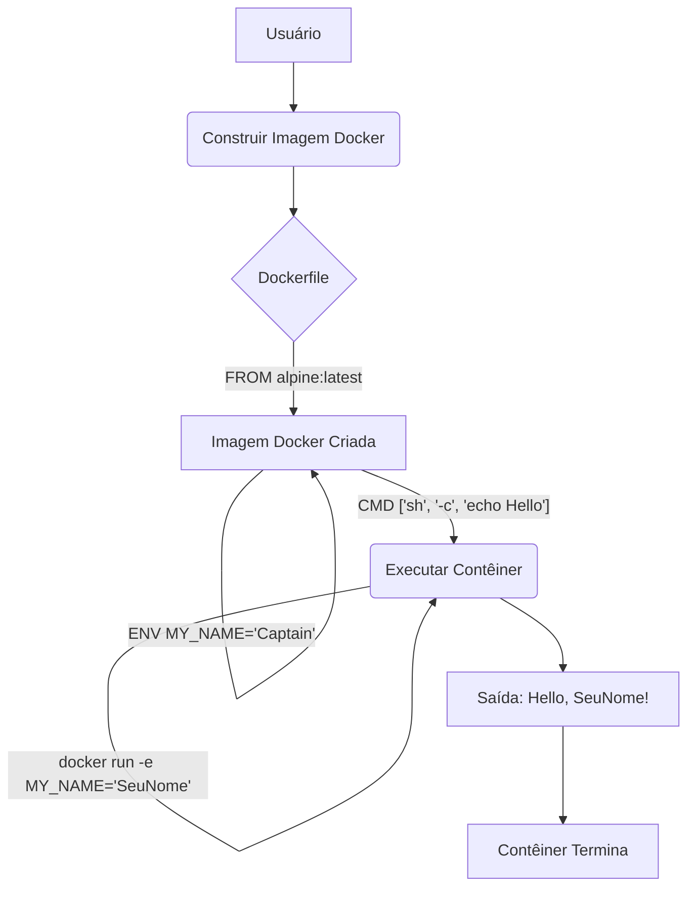

# 🚀 Desafio DevOps: Dockerfile Básico - "Hello, Captain!"

## 🎯 Propósito do Projeto

Este projeto demonstra a criação de um `Dockerfile` básico que gera uma imagem Docker capaz de imprimir uma mensagem de saudação personalizada no console. O objetivo principal é validar a compreensão fundamental de como o Docker constrói imagens e como os contêineres executam comandos. Este projeto também explora a parametrização de contêineres usando variáveis de ambiente.

## 🧠 Conceitos e Habilidades Validadas

*   **Dockerfile**: Criação e estrutura básica.
*   **Imagens Docker**: Construção de imagens a partir de um `Dockerfile`.
*   **Contêineres Docker**: Execução de contêineres a partir de imagens.
*   **`FROM`**: Seleção de uma imagem base (`alpine:latest`).
*   **`ENV`**: Definição e uso de variáveis de ambiente no Dockerfile.
*   **`CMD`**: Definição do comando de execução de um contêiner, com expansão de variáveis de ambiente.
*   **Parametrização**: Customização do comportamento do contêiner em tempo de execução.

## 🏛️ Arquitetura e Decisões Técnicas

A arquitetura para este projeto é propositalmente simples, focada na funcionalidade de um único contêiner.


**Decisões Técnicas:**

1.  **Imagem Base `alpine:latest`**:
    *   **Justificativa**: Conforme requisito do desafio, `alpine:latest` foi selecionada. É uma escolha excelente por seu tamanho mínimo, o que resulta em imagens Docker leves, rápidas para download e com uma superfície de ataque reduzida.
2.  **Uso de Variáveis de Ambiente (`ENV`)**:
    *   **Justificativa**: Optamos pela abordagem de variáveis de ambiente (`ENV` no `Dockerfile` e `-e` no `docker run`) para parametrizar a saudação. Esta é uma solução elegante e flexível que permite a personalização da mensagem em tempo de execução sem a necessidade de reconstruir a imagem Docker.
3.  **Comando de Execução (`CMD ["sh", "-c", "..."]`)**:
    *   **Justificativa**: Utilizamos o `CMD` no formato `exec-form` combinado com `sh -c` para garantir que a variável de ambiente `MY_NAME` seja corretamente expandida pelo shell antes que o comando `echo` seja executado. Isso permite uma saudação dinâmica.

## ⚙️ Guia de Execução Passo a Passo

Siga os passos abaixo para construir e executar este projeto:

1.  **Clone o Repositório (se ainda não o fez):**
```bash
git clone https://github.com/nilo-lima/DevOps_Master_Lab.git
```

<br />

2.  **Navegue até o Diretório do Projeto:**
```bash
cd DevOps_Master_Lab/projects/02-containerization/01-basic-dockerfile
```

<br />

3.  **Construa a Imagem Docker:**
```bash
docker build -t hello-captain:1.0 .
```
   *   Este comando cria a imagem `hello-captain` com a tag `1.0`.

<br />

4.  **Execute o Contêiner com a Saudação Padrão:**
```bash
docker run hello-captain:1.0
```
   *   **Saída esperada:** `Hello, Captain!`

<br />

5.  **Execute o Contêiner com uma Saudação Personalizada:**
```bash
docker run -e MY_NAME="[SeuNomeAqui]" hello-captain:1.0
```
   *   **Exemplo:** `docker run -e MY_NAME="DevOpsMentor" hello-captain:1.0`
   *   **Saída esperada:** `Hello, [SeuNomeAqui]!`
<br />

## 🚀 Próximos Passos e Evolução Técnica

*   **Validação de Entrada**: Melhorar o script para validar se o `MY_NAME` fornecido é válido ou se há múltiplos argumentos.
*   **Versão Multi-Arch**: Construir imagens multi-arquitetura para que o contêiner possa ser executado em diferentes plataformas (e.g., `amd64`, `arm64`).
*   **Docker Compose**: Integrar este contêiner a um arquivo `docker-compose.yml` para gerenciar múltiplas instâncias ou combiná-lo com outros serviços.
*   **CI/CD**: Configurar um pipeline de CI/CD para construir e publicar automaticamente a imagem em um registry Docker (como Docker Hub ou GHCR) a cada push.

## 📚 Lições Aprendidas

*   A importância de escolher a imagem base correta (`alpine` para leveza).
*   A flexibilidade da parametrização de contêineres usando variáveis de ambiente.
*   Diferenças práticas entre `RUN`, `CMD` e `ENV` e como combiná-los para um comportamento desejado.
*   A distinção entre argumentos de build (`ARG`) e argumentos de runtime (`ENV`/`-e`) e quando usar cada um.

---

## 💖 Apoie este Projeto Open Source

Se você gosta dos meus projetos, considere:
- 🏆 Me indicar para o GitHub Stars [Indicar Aqui](https://stars.github.com/nominate/)
- ⭐ Dar uma estrela nos repositórios
- 🐛 Reportar bugs ou melhorias
- 🤝 Contribuir com código

---

## ⚖️ Licença

Distribuído sob a licença **Apache 2.0**. Esta licença oferece permissão para uso, modificação e distribuição, além de garantir proteção contra disputas de patentes para colaboradores e usuários. Veja o arquivo [LICENSE](LICENSE) para mais informações.

---

This project is part of [roadmap.sh](https://roadmap.sh/projects/basic-dockerfile) DevOps projects.
