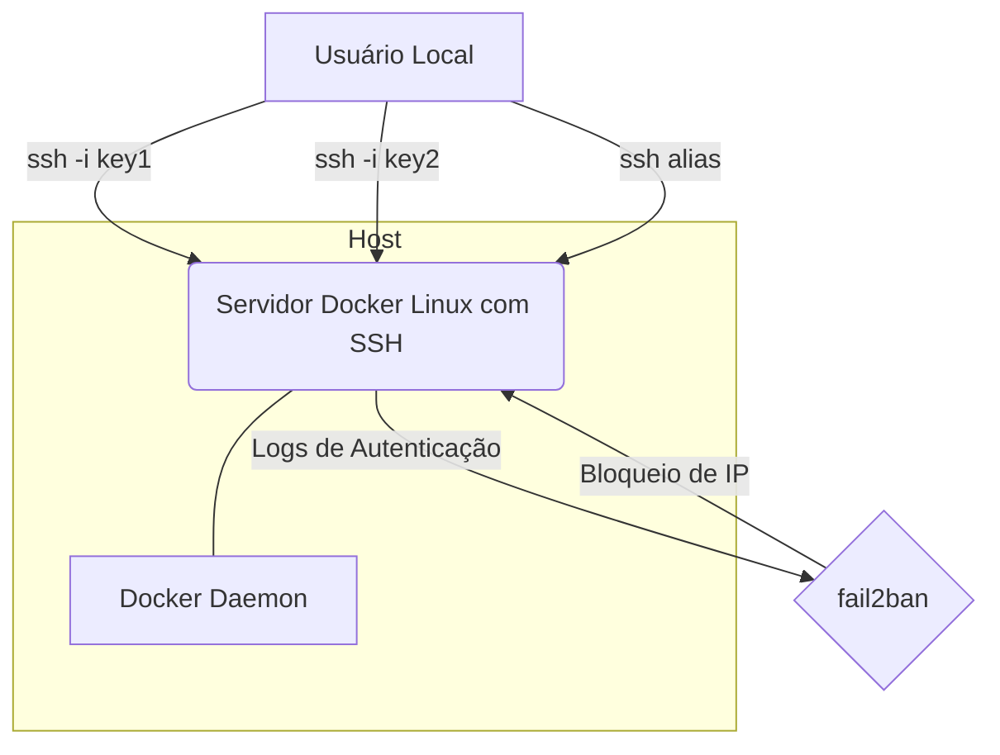

# 🔐 Servidor SSH com Fail2Ban em Docker

Este projeto demonstra a configuração de um servidor SSH dentro de um contêiner Docker, com autenticação baseada em chaves e proteção adicional contra ataques de força bruta usando Fail2Ban. O objetivo é fornecer uma base segura e reproduzível para aprendizado e experimentação com serviços SSH conteinerizados.

## 🎯 Objetivos do Projeto

*   Configurar um servidor Linux (Ubuntu) com OpenSSH em um contêiner Docker.
*   Permitir conexões SSH utilizando múltiplos pares de chaves SSH (sem autenticação por senha).
*   Implementar e configurar o Fail2Ban para monitorar logs de autenticação e banir IPs maliciosos.
*   Demonstrar a configuração de aliases de conexão SSH (`~/.ssh/config`) no host.
*   Criar uma documentação de elite para o projeto.

## 🏛️ Arquitetura



**Diagrama da Arquitetura:**

1.  **Usuário Local:** Sua máquina de desenvolvimento, de onde as chaves SSH são geradas e as conexões iniciadas.
2.  **Servidor Docker Linux com SSH:** Um contêiner Docker executando Ubuntu com o serviço `openssh-server` configurado para aceitar apenas autenticação por chave na porta `2222`.
3.  **Docker Daemon (no Host):** Gerencia o ciclo de vida do contêiner e mapeia a porta `2222` do contêiner para a porta `2222` do host, permitindo acesso externo.
4.  **Fail2Ban:** Um serviço de prevenção de intrusões rodando dentro do contêiner, configurado para monitorar logs de autenticação do SSH (`/var/log/auth.log`) e banir IPs que tentem falhar logins repetidamente, protegendo contra ataques de força bruta.

## ⚙️ Decisões Técnicas

*   **Imagem Base:** `ubuntu:latest` para o Dockerfile.
    *   **Justificativa:** Fornece uma base estável e familiar para iniciantes, com uma boa seleção de pacotes e documentação extensa, mantendo um equilíbrio entre tamanho e facilidade de uso.
*   **Autenticação SSH:** Exclusivamente por chaves SSH, com autenticação por senha desabilitada.
    *   **Justificativa:** Aumenta significativamente a segurança, eliminando a vulnerabilidade a ataques de força bruta baseados em senhas.
*   **Porta SSH:** Alterada de 22 (padrão) para 2222.
    *   **Justificativa:** Reduz o "ruído" de scanners automatizados que visam a porta SSH padrão, diminuindo o número de tentativas de acesso maliciosas.
*   **Usuário Dedicado:** Criação de um usuário `devops` não-root para acesso SSH.
    *   **Justificativa:** Segue o princípio do privilégio mínimo, evitando o acesso direto como `root`, que possui permissões ilimitadas.
*   **Fail2Ban:** Integrado no contêiner para monitorar e banir IPs maliciosos.
    *   **Justificativa:** Adiciona uma camada essencial de segurança, protegendo o servidor contra ataques de força bruta e garantindo a integridade do serviço.

## 🚀 Guia de Implementação e Execução

Siga os passos abaixo para configurar e executar o projeto:

### Pré-requisitos

*   [Docker](https://docs.docker.com/get-docker/) instalado na sua máquina host.
*   Cliente SSH (`ssh`) instalado no seu sistema operacional host.

### 1. Clonar o Repositório e Navegar até o Projeto

Se você ainda não clonou o repositório principal, faça-o:

```bash
git clone https://github.com/nilo-lima/devops-master-lab
cd DevOps_Master_Lab
```

Em seguida, navegue até o diretório específico do projeto:

```bash
cd projects/02-containerization/02-ssh-server-docker
```

### 2. Gerar Pares de Chaves SSH (no seu host)

Na sua máquina host, gere dois pares de chaves SSH. Use nomes de arquivo descritivos. Pressione `Enter` para pular a passphrase para este exercício.

```bash
ssh-keygen -t rsa -b 4096 -f ~/.ssh/my_ssh_key_1
ssh-keygen -t rsa -b 4096 -f ~/.ssh/my_ssh_key_2
```

### 3. Criar o `Dockerfile`, `jail.local` e `start.sh`

Certifique-se de que os seguintes arquivos existem no diretório do projeto (`projects/02-containerization/02-ssh-server-docker/`):

#### `Dockerfile`

```dockerfile
# Usar uma imagem base Ubuntu LTS para estabilidade e pacotes atualizados.
FROM ubuntu:latest

# Atualizar o sistema e instalar o OpenSSH server, Fail2Ban e utilitários essenciais.
# A flag -y evita prompts interativos. A flag --no-install-recommends otimiza o tamanho da imagem.
RUN apt-get update && \
    apt-get install -y --no-install-recommends openssh-server fail2ban sudo && \
    rm -rf /var/lib/apt/lists/*

# Configurar o diretório para o serviço SSH.
RUN mkdir /var/run/sshd

# Criar um usuário não-root para conexões SSH e adicionar ao grupo sudo.
# Usar um UID/GID fixo pode ser útil em alguns cenários, mas para este projeto, deixaremos dinâmico.
# A senha é definida aqui, mas a autenticação será feita via chave SSH para segurança.
# O usuário 'devops' será o usuário padrão para acesso SSH.
ARG SSH_USER=devops
ARG SSH_PASSWORD=password
RUN useradd -rm -d /home/${SSH_USER} -s /bin/bash -g root -G sudo ${SSH_USER} && \
    echo "${SSH_USER}:${SSH_PASSWORD}" | chpasswd

# Configurar o SSH para aceitar apenas autenticação por chave e desabilitar login de root.
# Mudar a porta SSH padrão de 22 para 2222 para evitar varreduras comuns.
RUN sed -i 's/#PermitRootLogin prohibit-password/PermitRootLogin no/' /etc/ssh/sshd_config && \
    sed -i 's/#PasswordAuthentication yes/PasswordAuthentication no/' /etc/ssh/sshd_config && \
    sed -i 's/UsePAM yes/UsePAM no/' /etc/ssh/sshd_config && \
    echo 'Port 2222' >> /etc/ssh/sshd_config && \
    echo 'AllowUsers devops' >> /etc/ssh/sshd_config

# Expor a porta 2222 que configuramos para o SSH.
EXPOSE 2222

# Configurar o Fail2Ban.
# Copiar um arquivo de configuração jail.local personalizado.
# Mais tarde, você precisará criar este arquivo jail.local no seu diretório do projeto.
COPY jail.local /etc/fail2ban/jail.local

# Conceder permissões para que o Fail2Ban possa iniciar.
RUN chmod 644 /etc/fail2ban/jail.local

# Adicionar um script de inicialização para o SSH e Fail2Ban.
# Este script garante que ambos os serviços sejam iniciados quando o contêiner for executado.
COPY start.sh /usr/local/bin/start.sh
RUN chmod +x /usr/local/bin/start.sh

# Definir o comando de entrada.
# Ao iniciar o contêiner, o script start.sh será executado.
CMD ["/usr/local/bin/start.sh"]
```

#### `jail.local` (Configuração do Fail2Ban)

```ini
[sshd]
enabled = true
port = 2222
filter = sshd
logpath = /var/log/auth.log
maxretry = 3
bantime = 1h
```

#### `start.sh` (Script de Inicialização do Contêiner)

```bash
#!/bin/bash

# Iniciar o serviço SSH
/usr/sbin/sshd

# Iniciar o serviço Fail2Ban
# Usar um PID file para o fail2ban no contêiner
/usr/bin/fail2ban-client -D

# Manter o contêiner rodando em primeiro plano
# Isso é importante para que o contêiner não saia após iniciar os serviços
tail -f /var/log/auth.log
```

### 4. Construir a Imagem Docker

No diretório do projeto (`projects/02-containerization/02-ssh-server-docker`), construa a imagem:

```bash
docker build -t ssh-server .
```

### 5. Executar o Contêiner Docker

Execute o contêiner, mapeando a porta 2222 do host para a porta 2222 do contêiner:

```bash
docker run -d -p 2222:2222 --name ssh-server-container ssh-server
```

### 6. Copiar Chaves Públicas para o Contêiner

Obtenha o conteúdo das suas chaves públicas geradas no Passo 2:

```bash
cat ~/.ssh/my_ssh_key_1.pub
cat ~/.ssh/my_ssh_key_2.pub
```

Substitua `<conteudo_da_chave_publica_1>` e `<conteudo_da_chave_publica_2>` pelos conteúdos reais e execute:

```bash
docker exec ssh-server-container bash -c "mkdir -p /home/devops/.ssh && chmod 700 /home/devops/.ssh"
docker exec ssh-server-container bash -c "echo '<conteudo_da_chave_publica_1>' >> /home/devops/.ssh/authorized_keys"
docker exec ssh-server-container bash -c "echo '<conteudo_da_chave_publica_2>' >> /home/devops/.ssh/authorized_keys"
docker exec ssh-server-container bash -c "chown devops:root /home/devops/.ssh/authorized_keys && chmod 600 /home/devops/.ssh/authorized_keys"
```

### 7. Testar Conexões SSH

Teste as conexões usando suas chaves privadas:

```bash
ssh -i ~/.ssh/my_ssh_key_1 devops@localhost -p 2222
ssh -i ~/.ssh/my_ssh_key_2 devops@localhost -p 2222
```

Para sair, digite `exit`.

### 8. Configurar Aliases SSH (no seu host)

Edite seu arquivo `~/.ssh/config` na sua máquina host (crie-o se não existir) e adicione as seguintes entradas:

```
Host ssh-server-key1
    HostName localhost
    User devops
    Port 2222
    IdentityFile ~/.ssh/my_ssh_key_1

Host ssh-server-key2
    HostName localhost
    User devops
    Port 2222
    IdentityFile ~/.ssh/my_ssh_key_2
```
Garanta as permissões corretas para o arquivo `~/.ssh/config`:

```bash
chmod 600 ~/.ssh/config
```

Teste os aliases:

```bash
ssh ssh-server-key1
ssh ssh-server-key2
```

### 9. Verificar e Testar Fail2Ban

Verifique o status do Fail2Ban no contêiner:

```bash
docker exec ssh-server-container fail2ban-client status
docker exec ssh-server-container fail2ban-client status sshd
```

Para testar o banimento, em um **novo terminal**, tente 3 logins SSH falhos. Por exemplo:

```bash
ssh -i ~/.ssh/my_ssh_key_invalid devops@localhost -p 2222
```
Após 3 tentativas, verifique novamente o status do `fail2ban` no contêiner para confirmar que seu IP foi banido.

Para desbanir (opcional):

```bash
docker exec ssh-server-container fail2ban-client set sshd unbanip <SEU_IP>
```

## 🧹 Limpeza

Para parar e remover o contêiner e a imagem Docker:

```bash
docker stop ssh-server-container
docker rm ssh-server-container
docker rmi ssh-server
```

## 💡 Lições Aprendidas

*   **Segurança SSH:** A importância de usar autenticação baseada em chaves e desabilitar a autenticação por senha.
*   **Princípio do Menor Privilégio:** Criação de usuários não-root para acesso SSH.
*   **Conteinerização de Serviços:** Como empacotar um serviço complexo (SSH + Fail2Ban) em um contêiner Docker.
*   **Automação de Segurança:** A eficácia do Fail2Ban na mitigação de ataques de força bruta.
*   **Melhoria da Usabilidade:** Utilização do `~/.ssh/config` para simplificar conexões.
*   **Boas Práticas de `Dockerfile`:** Uso de imagens base leves, otimização de camadas e scripts de inicialização.

---

## 💖 Apoie este Projeto Open Source

Se você gosta dos meus projetos, considere:
- 🏆 Me indicar para o GitHub Stars [Indicar Aqui](https://stars.github.com/nominate/)
- ⭐ Dar uma estrela nos repositórios
- 🐛 Reportar bugs ou melhorias
- 🤝 Contribuir com código

---

## ⚖️ Licença

Distribuído sob a licença **Apache 2.0**. Esta licença oferece permissão para uso, modificação e distribuição, além de garantir proteção contra disputas de patentes para colaboradores e usuários. Veja o arquivo [LICENSE](LICENSE) para mais informações.

---

This project is part of [roadmap.sh](https://roadmap.sh/projects/ssh-remote-server-setup) DevOps projects.
