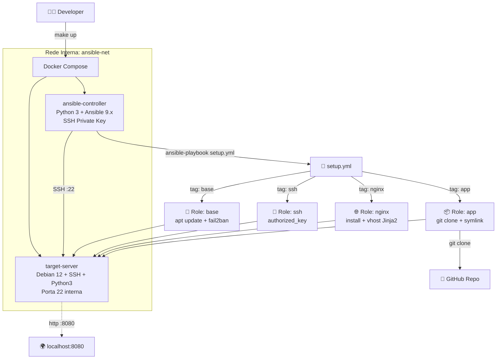

<div align="center">

# 🔧 Ansible Configuration Management

**Gerenciamento de Configuração Profissional: Automação Idempotente de Servidores com Ansible + Docker**


</div>

## 📋 Sobre o Projeto

Implementação de um sistema completo de gerenciamento de configuração usando Ansible, com **4 roles modulares** que configuram um servidor Linux do zero de forma **idempotente** — o mesmo playbook pode ser executado múltiplas vezes sem causar efeitos colaterais. Todo o ambiente é replicável via Docker Compose (controller + target), sem necessidade de um servidor em cloud.

| Funcionalidade | Descrição |
|:---|:---|
| **Role `base`** | Atualiza o servidor, instala utilitários essenciais (`curl`, `vim`, `git`, `htop`) e o `fail2ban` |
| **Role `nginx`** | Instala o Nginx, configura um vhost via template **Jinja2** e gerencia o ciclo de vida do serviço |
| **Role `app`** | Clona um repositório GitHub e implanta o site estático em `/opt/app` via symlink |
| **Role `ssh`** | Adiciona uma chave pública SSH ao `authorized_keys` do usuário configurado |
| **Execução por Tags** | Permite executar roles específicas com `--tags` para atualizações cirúrgicas |
| **Ambiente Docker** | Controller + Target via Docker Compose — 100% reprodutível sem cloud obrigatória |

## 🏗️ Arquitetura

```text
02-ansible-config-management/
├── ansible/
│   ├── setup.yml               # Playbook principal com todas as roles
│   ├── inventory.ini           # Aponta para o target container (hostname: target)
│   ├── ansible.cfg             # Configurações globais do Ansible
│   ├── requirements.yml        # Coleções Ansible necessárias (ansible.posix)
│   └── roles/
│       ├── base/               # apt update + utilitários + fail2ban
│       ├── nginx/              # Nginx + template Jinja2 do vhost
│       ├── app/                # git clone + symlink /var/www/html -> /opt/app
│       └── ssh/                # authorized_key para o usuário gerenciado
├── docker/
│   ├── ansible-controller/     # Debian slim + Python venv + Ansible 9.x
│   └── target-server/          # Debian slim + openssh-server + python3
├── app/
│   └── site/
│       └── index.html          # Site de demonstração para deploy
├── docker-compose.yml          # Orquestra controller + target na rede ansible-net
├── Makefile                    # Targets: setup, up, run, run-tags, down, clean
└── README.md
```



## 🧠 Justificativa das Decisões Técnicas

### ADR-001 — Simulação Local com Docker Compose (controller + target)

Em vez de exigir um servidor cloud (DigitalOcean, AWS), dois containers Docker simulam a topologia real: `ansible-controller` (máquina de controle) e `target-server` (servidor gerenciado), comunicando-se via SSH na rede interna `ansible-net`. Isso elimina custo, garante reprodutibilidade total e reflete fielmente como o Ansible opera em produção — a única diferença é que o "servidor remoto" roda localmente.

### ADR-002 — Geração de Chaves SSH Efêmeras via `make setup`

O `Makefile` gera um par de chaves Ed25519 em `docker/keys/` (pasta bloqueada pelo `.gitignore`). O `docker-compose.yml` monta a chave privada no controller e a pública no target via volume `:ro`. Essa abordagem evita hardcoding de chaves no repositório — o principal vetor de vazamento de segredos — e é equivalente ao uso de `ssh-agent` em ambientes de produção reais.

### ADR-003 — Deploy via `git clone` (GitHub) em vez de tarball

A role `app` usa `ansible.builtin.git` para clonar o repositório diretamente no servidor em `/opt/app`, depois cria um symlink `/var/www/html -> /opt/app`. Comparado ao tarball original do desafio, esse padrão permite rollbacks por branch/tag (via variável `app_branch`), re-deploys automáticos ao re-executar a role, e integração natural com pipelines CI/CD.

### ADR-004 — Idempotência com Módulos Nativos Ansible

Todas as tasks usam módulos nativos (`apt`, `service`, `git`, `authorized_key`, `template`, `file`) em vez de `shell`/`command`. Módulos nativos verificam o estado atual antes de agir: `apt: state=present` não reinstala um pacote já instalado, `file: state=link` não recria um symlink idêntico. Executar o playbook 10 vezes produz o mesmo resultado que executar 1 vez.

### ADR-005 — Handlers para Recarregamento Eficiente do Nginx

O Nginx é recarregado via `handler` (`notify: Reload Nginx`) em vez de um `service: state=reloaded` direto em cada task. Handlers executam **apenas ao final do play** e **apenas uma vez**, independentemente de quantas tasks os notificarem. Se tanto a remoção do site default quanto o deploy do vhost notificarem o handler, apenas um `nginx reload` ocorre no final — não dois.

### ADR-006 — fail2ban: Instalação Sem Gerenciamento de Serviço em Container

O `fail2ban` é instalado pela role `base` mas não iniciado, pois ele exige capabilities de `netfilter/iptables` não disponíveis em containers Docker sem `--privileged`. Em servidores reais (com systemd), a task de serviço deve ser habilitada. Essa distinção é documentada no código como comentário de contexto, não omitida silenciosamente.

## 🚀 Guia de Execução

### Pré-requisitos

| Ferramenta | Versão Mínima |
|:---|:---|
| Docker Engine | 24.x |
| Docker Compose Plugin | v2.x |
| GNU Make | 4.x |
| Git | 2.x |

### Configuração do Repositório de Deploy (Obrigatória)

A role `app` clona um repositório GitHub público. Antes de executar, configure a URL:

```bash
# Edite o arquivo e substitua pelo URL do seu repositório
vim ansible/roles/app/defaults/main.yml
```

```yaml
app_github_repo: "https://github.com/SEU-USUARIO/SEU-REPO-ESTATICO"
```

> **Não tem um repositório de site estático?** Use o site de demonstração incluído neste projeto:
> 1. Crie um novo repositório público no GitHub (ex: `ansible-demo-site`)
> 2. Copie o conteúdo de `app/site/` para a raiz do novo repositório
> 3. Faça o push e configure `app_github_repo` com a URL do repositório criado

### Execução Completa

```bash
# 1. Clonar o repositório
git clone https://github.com/nilo-lima/DevOps_Master_Lab.git
cd DevOps_Master_Lab/projects/03-infrastructure/02-ansible-config-management

# 2. Subir o ambiente (gera chaves SSH + build dos containers + start)
make up

# 3. Executar o playbook completo (todas as 4 roles em sequência)
make run

# 4. Acessar o site no browser
open http://localhost:8080
```

### Execução por Tags (Roles Individuais)

```bash
# Apenas a role base (atualização do sistema + utilitários)
make run-tags TAGS=base

# Apenas nginx (instala e configura o servidor web)
make run-tags TAGS=nginx

# Apenas app (re-deploy do site — ideal após push no GitHub)
make run-tags TAGS=app

# Apenas ssh (adicionar nova chave pública)
make run-tags TAGS=ssh

# Combinando múltiplas roles
make run-tags TAGS=base,nginx
```

### Equivalente com `ansible-playbook` Direto

```bash
# Executar playbook completo
ansible-playbook setup.yml

# Executar apenas a role app
ansible-playbook setup.yml --tags "app"

# Executar roles excluindo base
ansible-playbook setup.yml --skip-tags "base"
```

### Targets do Makefile

| Target | Descrição |
|:---|:---|
| `make setup` | Gera par de chaves SSH Ed25519 em `docker/keys/` |
| `make up` | `make setup` + build dos containers + start |
| `make run` | Executa o playbook completo (`setup.yml`) |
| `make run-tags TAGS=<tag>` | Executa roles específicas por tag |
| `make down` | Para e remove os containers |
| `make clean` | Remove containers, imagens e chaves SSH geradas |

## 📈 Próximos Passos

- [ ] Adicionar role `firewall` com `ufw` para restringir portas (apenas 22, 80, 443)
- [ ] Implementar `ansible-vault` para criptografar variáveis sensíveis (senhas, tokens de API)
- [ ] Criar role `monitoring` para instalar e configurar o Node Exporter (Prometheus)
- [ ] Adicionar suporte a múltiplos ambientes (`dev`, `staging`, `prod`) via `group_vars/`
- [ ] Integrar ao pipeline CI/CD para deploy automático no push para `main`
- [ ] Implementar testes de infraestrutura com **Molecule** + **Testinfra**
- [ ] Adicionar role `ssl` com Certbot/Let's Encrypt para HTTPS automático
- [ ] Publicar as roles no **Ansible Galaxy** como coleção reutilizável

## 🎓 Lições Aprendidas

**Idempotência é o coração do Ansible:** A diferença entre `shell: apt-get install nginx` e `apt: name=nginx state=present` não é estética — é arquitetural. O módulo `apt` verifica o estado atual do sistema antes de agir e reporta `ok` se o pacote já estiver instalado. Sem idempotência, cada re-execução do playbook causa efeitos colaterais imprevisíveis.

**Handlers resolvem um problema real de orquestração:** Quando múltiplas tasks modificam a configuração do Nginx (remoção do default site + deploy do novo vhost), sem handlers teríamos dois reloads consecutivos. Com handlers, o Nginx recarrega exatamente uma vez, ao final do play. Em servidores de produção com alto tráfego, isso é a diferença entre disponibilidade e downtime desnecessário.

**Docker democratiza o aprendizado de infraestrutura:** Antes deste projeto, aprender Ansible exigia um servidor cloud (~$5/mês mínimo). Com Docker Compose, qualquer desenvolvedor testa gerenciamento de configuração na própria máquina com fidelidade total. O controller se conecta ao target via SSH real — não é uma simulação, é a ferramenta rodando de verdade.

**Separação de concerns em roles exige disciplina:** A role `nginx` configura o servidor web; a role `app` gerencia o código da aplicação. A tentação de "simplificar" colocando o deploy no mesmo lugar que a configuração do Nginx cria acoplamento que dificulta atualizações parciais. A separação habilita o `--tags "app"` para re-deploys cirúrgicos sem retocar a configuração do servidor.

**Variáveis com defaults são a interface pública de uma role:** Definir `app_github_repo` em `defaults/main.yml` em vez de hardcoding transforma a role em uma unidade reutilizável. Qualquer projeto pode importá-la e sobrescrever apenas o necessário — o mesmo padrão de "configuração com sensíveis defaults" usado em bibliotecas de software maduras.

## 💖 Apoie este Projeto Open Source

Se você gosta dos meus projetos, considere:
- 🏆 Me indicar para o GitHub Stars [Indicar Aqui](https://stars.github.com/nominate/)
- ⭐ Dar uma estrela nos repositórios
- 🐛 Reportar bugs ou melhorias
- 🤝 Contribuir com código

## ⚖️ Licença

Distribuído sob a licença **Apache 2.0**. Esta licença oferece permissão para uso, modificação e distribuição, além de garantir proteção contra disputas de patentes para colaboradores e usuários. Veja o arquivo [LICENSE](LICENSE) para mais informações.

---

<div align="center">
  <sub>
    Projeto desenvolvido como parte do
    <a href="https://github.com/nilo-lima/DevOps_Master_Lab">DevOps Master Lab</a>
    · Pilar <strong>03 — Infrastructure</strong>
    · Baseado no desafio <a href="https://roadmap.sh/projects/configuration-management">roadmap.sh</a>
  </sub>
</div>
