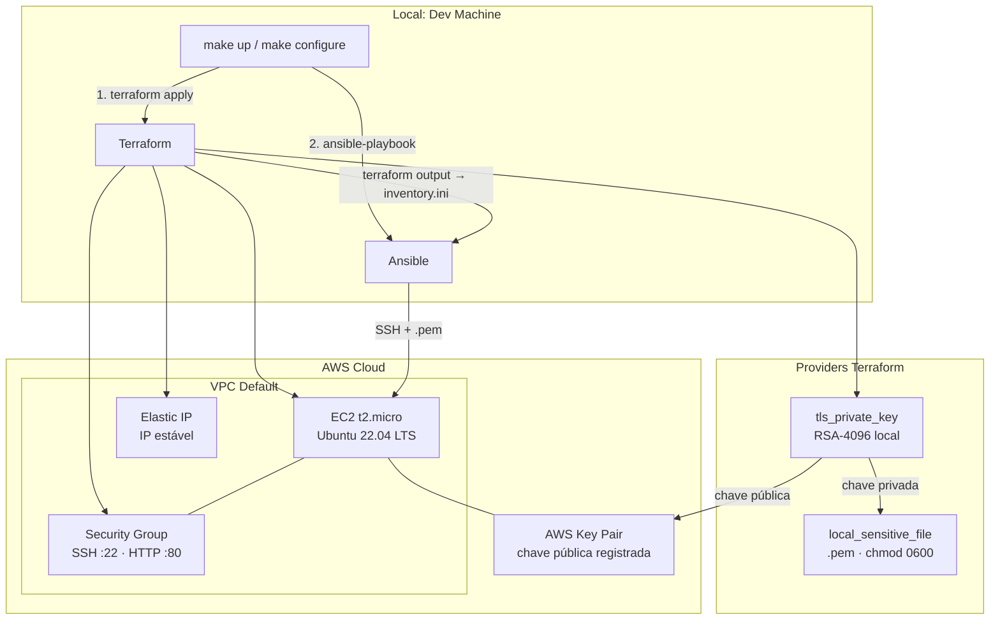

# 🏗️ IaC AWS EC2 - Terraform + Ansible

> Provisionamento e configuração de servidor web na AWS de forma 100% automatizada: um comando cria toda a infraestrutura, outro a configura.


---

## 📋 Sobre o Projeto

Implementação do desafio [IaC on DigitalOcean](https://roadmap.sh/projects/iac-digitalocean) adaptado para **AWS**, combinando Terraform e Ansible em uma pipeline de provisionamento end-to-end.

| Funcionalidade | Descrição |
|:---------------|:----------|
| **Geração de chave SSH via Terraform** | Par RSA-4096 criado localmente. A AWS nunca recebe a chave privada |
| **Infraestrutura zero-manual** | Security Group, Key Pair e Elastic IP criados 100% via código |
| **Inventário Ansible automático** | IP extraído do `terraform output` sem copiar IPs manualmente |
| **Configuração idempotente** | `ansible-playbook` pode ser re-executado sem efeitos colaterais |
| **Servidor web funcional** | Nginx instalado e servindo conteúdo via HTTP na instância real |
| **Proteção SSH ativa** | Fail2ban habilitado no boot contra ataques de brute-force |

---

## 🏗️ Arquitetura

### Estrutura de Diretórios

```text
03-iac-aws-ec2/
├── terraform/
│   ├── versions.tf      # Provider AWS + TLS + Local com constraints de versão
│   ├── variables.tf     # aws_region, instance_type, project_name
│   ├── main.tf          # tls_private_key, aws_key_pair, SG, EC2, EIP
│   └── outputs.tf       # instance_ip, private_key_path, ssh_command
├── ansible/
│   ├── ansible.cfg      # host_key_checking = False
│   ├── playbook.yml     # Orquestra roles: base → nginx
│   └── roles/
│       ├── base/        # apt update, pacotes essenciais, fail2ban
│       └── nginx/       # Instalação, vhost Jinja2, handler de reload
├── scripts/
│   └── deploy.sh        # Orquestra terraform apply → gera inventory.ini
├── Makefile             # Targets: up, configure, ssh, down, clean
├── .gitignore           # Bloqueia: *.pem, tfstate, inventory.ini
└── README.md
```

### Diagrama de Fluxo



---

## 🧠 Justificativa das Decisões Técnicas

### ADR-01: AWS em vez de DigitalOcean

**Decisão:** Adaptar o desafio original (DigitalOcean) para **AWS**.

**Contexto:** O laboratório já possui infraestrutura e credenciais AWS configuradas (projeto `01-aws-ec2-static-site`). A AWS tem maior adoção no mercado de trabalho brasileiro e oferece free tier elegível (`t2.micro`).

**Consequência:** Substituímos o provider `digitalocean` pelo provider `hashicorp/aws ~> 5.0`, mantendo 100% da proposta pedagógica do desafio.

---

### ADR-02: Geração de chave SSH via `tls_private_key`

**Decisão:** Usar o provider `hashicorp/tls` para gerar o par de chaves RSA-4096 dentro do Terraform.

**Alternativa rejeitada:** Criar o Key Pair manualmente no console AWS e referenciar o nome via variável (como no projeto 01 deste lab).

**Justificativa:** IaC puro exige que *nenhuma* etapa seja manual. Com `tls_private_key`, o Terraform gera a chave, registra a pública na AWS e salva a privada localmente com `chmod 0600` e tudo em um único `terraform apply`, sem interação humana.

---

### ADR-03: Security Group criado pelo Terraform (não pré-existente)

**Decisão:** Criar o Security Group como recurso `aws_security_group` no código.

**Alternativa rejeitada:** Referenciar um SG pré-existente via `data "aws_security_group"` (abordagem usada no projeto 01).

**Justificativa:** Dependências de recursos manuais quebram a reprodutibilidade. Qualquer pessoa com credenciais AWS pode executar este projeto do zero sem pré-requisitos de infraestrutura.

---

### ADR-04: Inventário Ansible gerado via `terraform output`

**Decisão:** O `deploy.sh` extrai o IP com `terraform output -raw instance_ip` e usa `realpath` para resolver o caminho absoluto da chave antes de gerar o `inventory.ini`.

**Alternativa rejeitada:** Inventário estático editado manualmente após o `apply`.

**Justificativa:** Elimina a etapa de copiar o IP do console para um arquivo, fonte frequente de erros humanos. O `realpath` resolve o caminho relativo retornado pelo Terraform (`./../iac-aws-ec2.pem`) para um caminho absoluto, garantindo que o Ansible encontre a chave independentemente do diretório de execução.

---

### ADR-05: `ansible.cfg` para desabilitar `host_key_checking`

**Decisão:** Usar `ansible/ansible.cfg` com `host_key_checking = False` em vez de `ansible_ssh_common_args` no inventário.

**Alternativa rejeitada:** Passar `-o StrictHostKeyChecking=no` inline no `inventory.ini`.

**Justificativa:** A abordagem inline em arquivos INI é frágil, onde quebras de linha silenciosas fazem o Ansible interpretar opções SSH como hostnames (bug encontrado e corrigido neste projeto). O `ansible.cfg` é o lugar semântico correto para configurações do Ansible.

---

### ADR-06: Reutilização das roles do projeto 02

**Decisão:** Adaptar as roles `base` e `nginx` criadas no projeto `02-ansible-config-management`.

**Justificativa:** Promove reusabilidade e consolida o aprendizado anterior. A diferença crítica: a role `base` agora inicia o `fail2ban` com `state: started` e `enabled: true`,  impossível em containers Docker (projeto 02), mas necessário em servidor real para proteção no boot.

---

## 🚀 Guia de Execução

### Pré-requisitos

| Ferramenta | Versão mínima | Instalação |
|:-----------|:-------------|:-----------|
| Terraform | >= 1.5.0 | [developer.hashicorp.com/terraform/install](https://developer.hashicorp.com/terraform/install) |
| Ansible | >= 2.16 | `sudo apt install ansible-core` |
| AWS CLI | >= 2.0 | [aws.amazon.com/cli](https://aws.amazon.com/cli) |
| Credenciais AWS | - | `aws configure` |

### Execução

```bash
# 1. Provisiona a infraestrutura na AWS (EC2, SG, Key Pair, EIP)
make up

# 2. Configura o servidor (instala Nginx, fail2ban, deploya página)
make configure

# 3. Acessa a página no navegador
# http://<IP exibido no output>

# 4. Conecta via SSH
make ssh

# 5. Destrói tudo ao finalizar os testes
make clean
```

### Targets do Makefile

| Target | Descrição |
|:-------|:----------|
| `make up` | Valida pré-requisitos → `terraform apply` → gera `inventory.ini` |
| `make configure` | Executa `ansible-playbook` contra a EC2 real |
| `make ssh` | Abre sessão SSH usando IP e chave do Terraform output |
| `make down` | Executa `terraform destroy` (remove todos os recursos AWS) |
| `make clean` | `down` + remove artefatos locais (`.pem`, `tfstate`, inventário) |

---

## 📈 Próximos Passos

- [ ] Adicionar remote state no S3 com state locking via DynamoDB
- [ ] Implementar `wait_for_connection` no playbook para substituir o `sleep 15`
- [ ] Restringir o Security Group para aceitar SSH apenas do IP do desenvolvedor
- [ ] Adicionar role `app` para deploy de aplicação real (Python/Node)
- [ ] Configurar HTTPS com Certbot + Let's Encrypt via Ansible
- [ ] Criar módulo Terraform reutilizável para o padrão EC2 + EIP + SG

---

## 🎓 Lições Aprendidas

**1. IaC é sobre eliminar etapas manuais, não apenas sobre código.**
O projeto 01 deste lab usava SG, Key Pair e IAM Role pré-existentes. Era Terraform "parcial". Este projeto demonstra IaC verdadeiro: partindo do zero, qualquer pessoa com credenciais AWS replica a infra completa em minutos.

**2. Caminhos relativos são armadilhas em pipelines de automação.**
O Terraform salva a chave com path relativo ao diretório `terraform/`. Quando o Ansible rodam do diretório raiz do projeto, `./../iac-aws-ec2.pem` não resolvia corretamente. O `realpath` no `deploy.sh` resolve isso convertendo para caminho absoluto antes de escrever o inventário.

**3. Arquivos INI do Ansible são sensíveis a quebras de linha.**
`ansible_ssh_common_args='-o StrictHostKeyChecking=no'` em uma nova linha do inventário faz o Ansible interpretar a string como um hostname, um erro silencioso e difícil de diagnosticar. A solução correta é o `ansible.cfg`.

**4. `enabled: true` faz diferença entre Docker e servidor real.**
No projeto 02, o Ansible rodava contra containers Docker sem capabilities de kernel e o fail2ban não podia iniciar. Em EC2 real, omitir `enabled: true` significa que o serviço morre no próximo reboot. Contexto de execução muda as boas práticas.

---

## 💖 Apoie este Projeto Open Source

Se você gosta dos meus projetos, considere:
- 🏆 Me indicar para o GitHub Stars [Indicar Aqui](https://stars.github.com/nominate/)
- ⭐ Dar uma estrela nos repositórios
- 🐛 Reportar bugs ou melhorias
- 🤝 Contribuir com código

---

## ⚖️ Licença

Distribuído sob a licença **Apache 2.0**. Esta licença oferece permissão para uso, modificação e distribuição, além de garantir proteção contra disputas de patentes para colaboradores e usuários. Veja o arquivo [LICENSE](LICENSE) para mais informações.

---

<div align="center">
  <sub>
    Projeto desenvolvido como parte do
    <a href="https://github.com/nilo-lima/DevOps_Master_Lab">DevOps Master Lab</a>
    · Pilar <strong>03 - Infrastructure</strong>
    · Baseado no desafio <a href="https://roadmap.sh/projects/iac-digitalocean">roadmap.sh</a>
  </sub>
</div>
