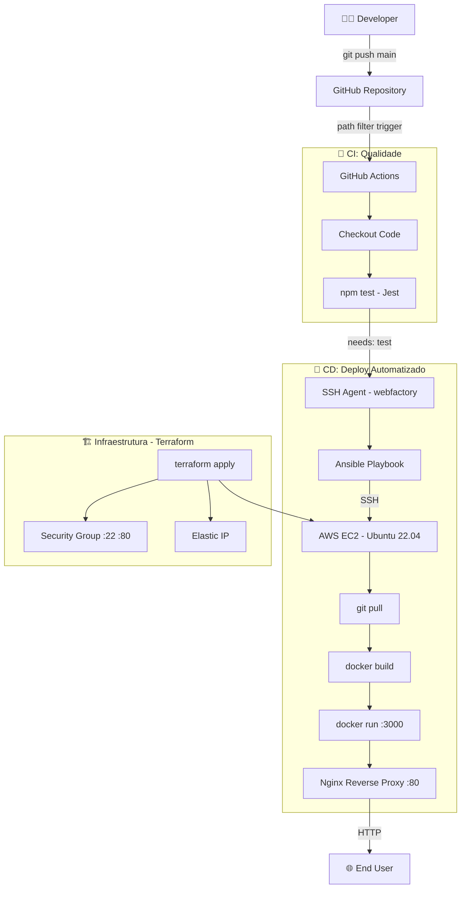

# Node.js Service Deployment

> Pipeline CI/CD completo: do `git push` ao deploy automatizado em AWS EC2 via GitHub Actions + Ansible.


---

## 📋 Sobre o Projeto

Este projeto implementa um serviço Node.js com Express e uma pipeline CI/CD completa que integra três pilares de DevOps em um fluxo automatizado de ponta a ponta. Um `git push` na branch `main` dispara automaticamente os testes, o build e o deploy na infraestrutura AWS.

| Funcionalidade | Descrição |
|:---------------|:----------|
| **API REST** | Endpoints `GET /` e `GET /health` com resposta JSON |
| **Testes automatizados** | Suite Jest com cobertura de 100% das linhas |
| **Containerização** | Dockerfile multi-stage com usuário não-root e health check |
| **Infraestrutura como Código** | EC2 + Security Group + Elastic IP provisionados via Terraform |
| **Gerenciamento de Configuração** | Roles Ansible `base` (Docker, Nginx, Git) e `app` (deploy) |
| **Pipeline CI/CD** | GitHub Actions: test → deploy em sequência, com path filter |
| **Reverse Proxy** | Nginx encaminha tráfego da porta 80 para a aplicação na 3000 |

---

## 🏗️ Arquitetura

### Estrutura de Diretórios

```text
01-nodejs-service-deployment/
├── app/
│   ├── src/
│   │   └── server.js            # Express app (GET / e GET /health)
│   ├── test/
│   │   └── server.test.js       # Testes Jest + Supertest
│   ├── package.json
│   └── Dockerfile               # Multi-stage: builder → runtime
├── infra/
│   ├── main.tf                  # EC2, Security Group, Elastic IP
│   ├── variables.tf
│   ├── outputs.tf
│   └── terraform.tfvars.example
├── config/
│   ├── ansible.cfg
│   ├── inventory/
│   │   └── hosts.yml.example
│   ├── roles/
│   │   ├── base/                # Docker, Nginx, Git
│   │   └── app/                 # Clone, build, run, nginx proxy
│   └── node_service.yml
├── .github/
│   └── workflows/
│       └── nodejs-deploy.yml    # Pipeline CI/CD (path-filtered)
├── Makefile
└── README.md
```

### Diagrama de Fluxo



---

## 🧠 Justificativa das Decisões Técnicas

**ADR-01: AWS EC2 em vez de DigitalOcean Droplet**
O desafio original sugere DigitalOcean, mas optou-se por AWS EC2 para manter consistência com os projetos anteriores do lab (`03-infrastructure`) e reutilizar credenciais e módulos Terraform já validados. A experiência AWS tem maior demanda no mercado de trabalho.

**ADR-02: Ansible no GitHub Actions (Opção 1 do desafio)**
Dentre as duas abordagens propostas pelo roadmap.sh (Ansible vs. SSH direto), escolheu-se o Ansible por garantir **idempotência**: o playbook pode ser executado múltiplas vezes sem efeitos colaterais. Isso permite re-execuções seguras do pipeline em caso de falha parcial.

**ADR-03: Docker na EC2 em vez de pm2 ou systemd**
O Docker isola o processo da aplicação, garante reprodutibilidade entre ambientes e permite rollback trivial (`docker run` de uma imagem anterior). O flag `--restart always` substitui a necessidade de um process manager como o pm2.

**ADR-04: Dockerfile multi-stage**
O stage `builder` instala todas as devDependencies e executa os testes durante o build. O stage `runtime` copia apenas o código e as dependências de produção, resultando em uma imagem ~60% menor e sem ferramentas de desenvolvimento expostas.

**ADR-05: webfactory/ssh-agent para gerenciamento de chave SSH**
O uso de `echo` para escrever a chave privada no runner causa falhas com chaves multi-linha. A action `webfactory/ssh-agent` gerencia o carregamento da chave via SSH Agent de forma robusta, sendo a mesma abordagem usada no restante do lab.

**ADR-06: Path filter no workflow**
O repositório é um monorepo com múltiplos projetos. O path filter `projects/05-automation/01-nodejs-service-deployment/**` garante que o pipeline seja disparado **apenas quando arquivos deste projeto forem modificados**, evitando deploys desnecessários causados por mudanças em outros pilares.

**ADR-07: Nginx como reverse proxy**
A aplicação escuta na porta 3000 (porta não-privilegiada, compatível com usuário não-root no Docker). O Nginx na porta 80 faz o proxy reverso, centralizando futuras configurações de SSL, rate limiting e logs de acesso sem alterar a aplicação.

---

## 🚀 Guia de Execução

### Pré-requisitos

| Ferramenta | Versão mínima |
|:-----------|:-------------|
| Node.js | 20.x |
| Docker | 24.x |
| Terraform | 1.3.x |
| Ansible | 2.13.x |
| AWS CLI | 2.x (credenciais configuradas) |

### Opção 1: Execução local via Docker

```bash
# Clone o repositório
git clone https://github.com/nilo-lima/devops-master-lab.git
cd devops-master-lab/projects/05-automation/01-nodejs-service-deployment

# Build e execução
make up

# Validar
curl http://localhost:3000/
curl http://localhost:3000/health
```

### Opção 2: Deploy completo na AWS

```bash
# 1. Copie e preencha as variáveis
cp infra/terraform.tfvars.example infra/terraform.tfvars

# 2. Provisione a infraestrutura
make infra-up

# 3. Configure o inventário Ansible com o IP do output
cp config/inventory/hosts.yml.example config/inventory/hosts.yml
# Edite hosts.yml com o public_ip retornado pelo terraform

# 4. Execute o provisionamento
cd config
ansible-playbook node_service.yml --tags base
ansible-playbook node_service.yml --tags app

# 5. Valide
curl http://<public_ip>/
```

### Tabela de Targets (Makefile)

| Target | Descrição |
|:-------|:----------|
| `make setup` | Instala dependências Node.js |
| `make dev` | Inicia servidor em modo watch |
| `make test` | Executa suite Jest com cobertura |
| `make infra-up` | Provisiona infraestrutura AWS via Terraform |
| `make infra-down` | Destrói infraestrutura AWS |
| `make up` | Build e execução local via Docker |
| `make down` | Para e remove container local |
| `make clean` | Remove container, imagem e artefatos |

---

## 🔄 Pipeline CI/CD

```
git push (main)
    │
    ├─ path filter: projects/05-automation/01-nodejs-service-deployment/**
    │
    ├─ Job: Testes e Lint
    │   ├─ actions/checkout@v4
    │   ├─ actions/setup-node@v4 (Node 20, cache npm)
    │   ├─ npm ci
    │   └─ npm test (Jest + cobertura)
    │
    └─ Job: Deploy via Ansible (needs: test)
        ├─ webfactory/ssh-agent (carrega EC2_NODE_SSH_KEY)
        ├─ ssh-keyscan → known_hosts
        ├─ pip install ansible
        ├─ Gera inventory dinâmico com EC2_HOST e EC2_USER
        └─ ansible-playbook node_service.yml --tags app
```

### GitHub Secrets necessários

| Secret | Descrição |
|:-------|:----------|
| `EC2_NODE_SSH_KEY` | Conteúdo completo do arquivo `.pem` |
| `EC2_HOST` | IP público da EC2 (Elastic IP) |
| `EC2_USER` | Usuário SSH (`ubuntu`) |

---

## 📈 Próximos Passos

- [ ] Adicionar HTTPS com Let's Encrypt via Certbot no role Nginx
- [ ] Implementar notificação Slack no pipeline (sucesso/falha)
- [ ] Adicionar step de rollback automático em caso de falha no health check pós-deploy
- [ ] Migrar state do Terraform para S3 + DynamoDB (locking)
- [ ] Criar ambiente de staging separado com aprovação manual para produção
- [ ] Adicionar métricas Prometheus e dashboard Grafana para a aplicação

---

## 🎓 Lições Aprendidas

**1. Repositórios privados bloqueiam clones na EC2**
O Ansible tentava clonar via HTTPS um repositório privado. A EC2 não tem credenciais GitHub, resultando em timeout silencioso. A solução foi garantir que o repositório fosse público ou usar deploy keys.

**2. Security Group restritivo bloqueia GitHub Actions**
O runner do GitHub Actions usa IPs dinâmicos diferentes do IP local do desenvolvedor. Ao restringir SSH ao IP pessoal (`/32`), o pipeline falhava no `ssh-keyscan`. Para pipelines CI/CD, SSH deve aceitar `0.0.0.0/0` ou usar as faixas de IP publicadas pelo GitHub.

**3. Chaves SSH multi-linha quebram com `echo` no CI**
O `echo` em shell não preserva quebras de linha de chaves PEM corretamente. A action `webfactory/ssh-agent` resolve isso de forma robusta, carregando a chave no agente SSH do runner sem tocar em arquivos.

**4. Módulos `community.docker` têm incompatibilidades de versão**
O módulo `community.docker.docker_image` exige parâmetros que variam conforme a versão instalada. Substituir por `ansible.builtin.command` com chamadas diretas ao CLI do Docker elimina a dependência de versão e torna o código mais transparente e fácil de debugar.

**5. `stdout_callback = yaml` foi removido do community.general 12.0**
A configuração `stdout_callback = yaml` no `ansible.cfg` usa um plugin descontinuado. Em versões modernas, a saída YAML é configurada com `stdout_callback = default` + `result_format = yaml`, ou simplesmente removida para usar o formato padrão.

---

## 💖 Apoie este Projeto Open Source

Se você gosta dos meus projetos, considere:
- 🏆 Me indicar para o GitHub Stars [Indicar Aqui](https://stars.github.com/nominate/)
- ⭐ Dar uma estrela nos repositórios
- 🐛 Reportar bugs ou melhorias
- 🤝 Contribuir com código

---

## ⚖️ Licença

Distribuído sob a licença **Apache 2.0**. Esta licença oferece permissão para uso, modificação e distribuição, além de garantir proteção contra disputas de patentes para colaboradores e usuários. Veja o arquivo [LICENSE](LICENSE) para mais informações.

---

<div align="center">
  <sub>
    Projeto desenvolvido como parte do
    <a href="https://github.com/nilo-lima/devops-master-lab">DevOps Master Lab</a>
    · Pilar <strong>05: Automation</strong>
    · Baseado no desafio <a href="https://roadmap.sh/projects/nodejs-service-deployment">roadmap.sh</a>
  </sub>
</div>
