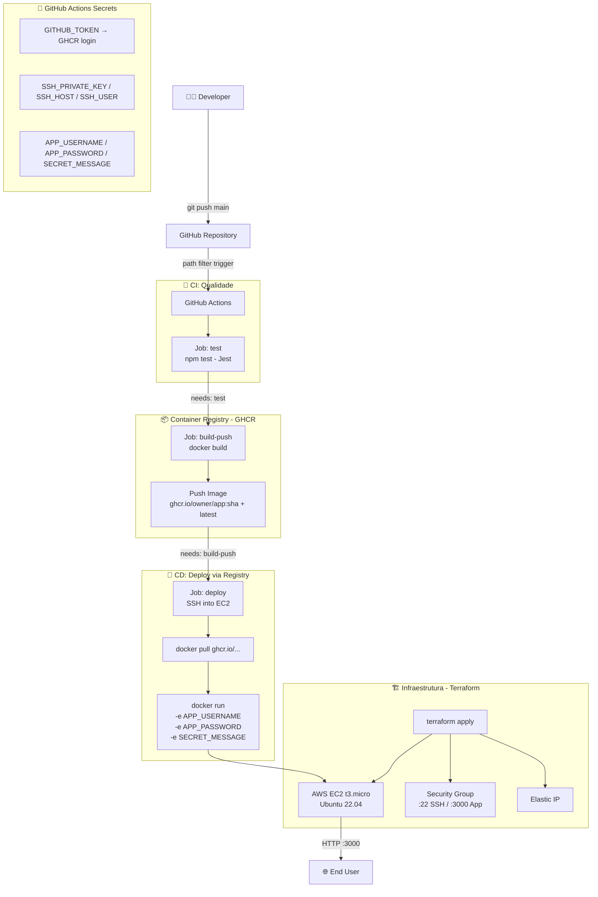

# Dockerized Service Deployment

> Pipeline CI/CD completo: `git push` → testes → build de imagem Docker → push para GHCR → deploy automatizado em AWS EC2.


---

## 📋 Sobre o Projeto

Este projeto containeriza um serviço Node.js com autenticação HTTP e implementa um pipeline CI/CD de ponta a ponta usando o **GitHub Container Registry (GHCR)** como elo central entre o código e a infraestrutura. Cada `git push` na branch `main` dispara automaticamente os testes, publica a imagem no registry e realiza o deploy na AWS.

| Funcionalidade | Descrição |
|:---|:---|
| **API REST** | `GET /` com resposta pública e `GET /secret` protegida por Basic Auth |
| **Autenticação HTTP** | Basic Auth com validação de `USERNAME` e `PASSWORD` via variáveis de ambiente |
| **Testes automatizados** | Suite Jest + Supertest com cobertura de 100% das linhas |
| **Containerização** | Dockerfile single-stage com `node:20-alpine`, usuário não-root e HEALTHCHECK |
| **Container Registry** | Imagem publicada no GHCR com tag por SHA de commit e tag `latest` |
| **Infraestrutura como Código** | EC2 `t3.micro` + Security Group + Elastic IP provisionados via Terraform |
| **Pipeline CI/CD** | GitHub Actions com 3 jobs sequenciais: `test → build-push → deploy` |
| **Secrets em runtime** | Credenciais injetadas via `-e` no `docker run` — nunca entram na imagem |

---

## 🏗️ Arquitetura

### Estrutura de Diretórios

```text
02-dockerized-service-deployment/
├── app/
│   ├── src/
│   │   └── server.js            # Express: GET / e GET /secret (Basic Auth)
│   ├── test/
│   │   └── server.test.js       # Jest + Supertest (4 cenários de autenticação)
│   ├── package.json
│   ├── .env.example             # Template de variáveis (sem valores reais)
│   └── Dockerfile               # Single-stage: node:20-alpine, non-root, HEALTHCHECK
├── infra/
│   ├── main.tf                  # EC2 t3.micro, Security Group, Elastic IP, SSH Key
│   ├── variables.tf
│   ├── outputs.tf               # IP público, comando SSH, URL da app
│   ├── versions.tf
│   └── .terraform.lock.hcl
├── .github/
│   └── workflows/
│       └── dockerized-deploy.yml  # Pipeline: test → build-push → deploy
├── Makefile                     # Atalhos: setup, dev, test, up, down, clean
├── .gitignore
└── README.md
```

### Diagrama de Fluxo



---

## 🧠 Justificativa das Decisões Técnicas

**ADR-01: GitHub Container Registry (GHCR) em vez de Docker Hub**
O GHCR é integrado nativamente ao GitHub Actions via `GITHUB_TOKEN` automático — sem criação de PATs manuais para repositórios públicos. O Docker Hub impõe rate limiting agressivo (100 pulls/6h para usuários anônimos) e exige credenciais extras. Para um lab hospedado no GitHub, GHCR é a escolha natural, segura e sem custo adicional.

**ADR-02: Secrets injetados em runtime via `docker run -e`, não em build-time**
Embutir variáveis sensíveis no `docker build` (`ARG`/`ENV`) as expõe nas camadas da imagem, recuperáveis com `docker history`. A injeção via `-e` no `docker run` mantém os valores exclusivamente na memória do processo em execução, sem rastros na imagem ou no filesystem da EC2.

**ADR-03: Tag de imagem com SHA do commit + tag `latest`**
A tag `sha-abc1234` garante rastreabilidade total: cada imagem no registry é vinculada a um commit específico, permitindo auditoria e rollback trivial (`docker run ghcr.io/.../app:sha-abc1234`). A tag `latest` simplifica o deploy sem precisar passar o SHA como variável entre jobs.

**ADR-04: Pipeline em 3 jobs sequenciais com `needs:`**
A separação `test → build-push → deploy` garante que: (1) código com falha de teste nunca chega ao registry; (2) imagem publicada sem deploy bem-sucedido não fica orphan no GHCR. O `needs:` do GitHub Actions torna a dependência explícita e o pipeline para no primeiro job com falha.

**ADR-05: Dockerfile single-stage com `node:20-alpine`**
Diferente de projetos com etapa de build de assets (TypeScript, React), Node.js puro é interpretado — não há compilação. O single-stage com Alpine já produz uma imagem enxuta (~160MB). O multi-stage adicionaria complexidade sem benefício real neste contexto.

**ADR-06: EC2 `t3.micro` em vez de `t2.micro`**
O `t3.micro` é geração mais recente (2018 vs. 2014), oferece baseline de CPU maior (20% vs. 10%), burst ilimitado por padrão, melhor performance de rede e é ligeiramente mais barato ($0.0104/hr vs. $0.0116/hr em us-east-1) — mantendo elegibilidade ao Free Tier de 750h/mês.

**ADR-07: `user_data` para instalação automática do Docker**
Ao invés de um passo manual de SSH pós-provisionamento, o script no `user_data` instala o Docker automaticamente no first boot da EC2. A instância emerge pronta para receber o primeiro deploy sem intervenção humana, tornando o provisionamento 100% automatizado.

---

## 🚀 Guia de Execução

### Pré-requisitos

| Ferramenta | Versão mínima | Uso |
|:---|:---|:---|
| Node.js | 20.x | Desenvolvimento e testes locais |
| Docker | 24.x | Build e execução local da imagem |
| Terraform | 1.0+ | Provisionamento da infraestrutura AWS |
| AWS CLI | 2.x | Autenticação para o Terraform |

### Opção 1 — Execução Local (sem Docker)

```bash
cd app
cp .env.example .env
# Edite .env com seus valores

npm install
npm run dev
```

### Opção 2 — Execução via Docker (Makefile)

```bash
cd projects/05-automation/02-dockerized-service-deployment

# Criar o .env com suas variáveis
cp app/.env.example app/.env

# Build e execução do container
make up

# Testar os endpoints
curl http://localhost:3000/
curl http://localhost:3000/secret                         # 401
curl -u wrong:creds http://localhost:3000/secret          # 403
curl -u SEU_USERNAME:SUA_PASSWORD http://localhost:3000/secret  # 200
```

### Targets do Makefile

| Target | Descrição |
|:---|:---|
| `make setup` | Instala dependências Node.js |
| `make dev` | Sobe o servidor em modo watch |
| `make test` | Executa a suite Jest com cobertura |
| `make up` | Build e execução do container Docker |
| `make down` | Para e remove o container |
| `make clean` | Remove container, imagem e artefatos |

### Opção 3 — Provisionamento da Infraestrutura

```bash
cd infra

terraform init
terraform plan
terraform apply -auto-approve

# Output: IP público da EC2, comando SSH e URL da app
```

---

## 🔄 Pipeline CI/CD

O workflow `.github/workflows/dockerized-deploy.yml` é disparado em todo `git push` na branch `main` que altere arquivos dentro de `projects/05-automation/02-dockerized-service-deployment/`.

### Secrets necessários no GitHub Actions

| Secret | Descrição |
|:---|:---|
| `SSH_HOST` | IP público da EC2 (output do Terraform) |
| `SSH_USER` | Usuário SSH (ex: `ubuntu`) |
| `SSH_PRIVATE_KEY` | Conteúdo completo do arquivo `.pem` |
| `APP_USERNAME` | Username para Basic Auth |
| `APP_PASSWORD` | Senha para Basic Auth |
| `SECRET_MESSAGE` | Mensagem retornada pela rota `/secret` |

> O `GITHUB_TOKEN` para autenticação no GHCR é gerado automaticamente pelo Actions — não requer configuração manual.

### Fluxo do Pipeline

```
git push main
    │
    ▼
┌─────────────────────────────────────────────────┐
│  Job: test                                       │
│  ├── actions/checkout@v4                         │
│  ├── actions/setup-node@v4 (cache npm)           │
│  ├── npm ci                                      │
│  └── npm test (Jest + cobertura)                 │
└─────────────────┬───────────────────────────────┘
                  │ needs: test
                  ▼
┌─────────────────────────────────────────────────┐
│  Job: build-push                                 │
│  ├── docker/login-action (GHCR via GITHUB_TOKEN) │
│  ├── docker/metadata-action (tags sha + latest)  │
│  └── docker/build-push-action (push: true)       │
└─────────────────┬───────────────────────────────┘
                  │ needs: build-push
                  ▼
┌─────────────────────────────────────────────────┐
│  Job: deploy                                     │
│  └── appleboy/ssh-action                         │
│      ├── docker login ghcr.io                    │
│      ├── docker pull :latest                     │
│      ├── docker stop/rm (container anterior)     │
│      ├── docker run -e (secrets em runtime)      │
│      └── docker image prune -f                   │
└─────────────────────────────────────────────────┘
```

---

## 📈 Próximos Passos

- [ ] Adicionar Nginx como reverse proxy (porta 80 → 3000)
- [ ] Implementar HTTPS com Let's Encrypt + Certbot
- [ ] Adicionar multi-environment (staging e production)
- [ ] Implementar rollback automático em caso de falha no healthcheck pós-deploy
- [ ] Substituir EC2 standalone por ECS Fargate (serverless containers)
- [ ] Adicionar scan de vulnerabilidades na imagem com Trivy no pipeline
- [ ] Publicar imagem também no Docker Hub como espelho público

---

## 🎓 Lições Aprendidas

**1. O Container Registry muda o paradigma do deploy**
No projeto anterior (`01-nodejs-service-deployment`), o deploy era: SSH → git clone → docker build na EC2. Neste projeto, o deploy é: docker pull. A EC2 não precisa compilar nada — ela apenas consome a imagem pronta do registry. Isso torna o deploy mais rápido, mais previsível e elimina dependências de build na máquina de produção.

**2. Arquivos `.terraform/` e `terraform.tfstate` nunca devem ser commitados**
O `terraform.tfstate` contém dados sensíveis em texto plano, incluindo chaves privadas geradas pelo provider `tls`. O diretório `.terraform/` contém binários de providers que podem ter centenas de megabytes. Ambos devem estar no `.gitignore` desde o início do projeto — o GitHub rejeita pushes com arquivos acima de 100MB, o que foi aprendido na prática.

**3. Workflows GitHub Actions pertencem à raiz do repositório**
O GitHub Actions só reconhece arquivos de workflow em `.github/workflows/` na **raiz** do repositório, independentemente da estrutura de diretórios do projeto. Em um monorepo com múltiplos projetos, todos os workflows ficam na raiz e o filtro `paths:` garante que cada workflow só dispara para as mudanças relevantes ao seu projeto.

**4. Secrets em runtime vs. build-time é uma decisão de segurança, não de conveniência**
A tentação de passar variáveis como `ARG` no `docker build` existe, mas qualquer dado passado em build-time fica registrado nas camadas da imagem. A injeção via `docker run -e` mantém os segredos fora da imagem e fora do registry — um princípio inegociável em ambientes de produção.

---

## 💖 Apoie este Projeto Open Source

Se você gosta dos meus projetos, considere:
- 🏆 Me indicar para o GitHub Stars [Indicar Aqui](https://stars.github.com/nominate/)
- ⭐ Dar uma estrela nos repositórios
- 🐛 Reportar bugs ou melhorias
- 🤝 Contribuir com código

---

## ⚖️ Licença

Distribuído sob a licença **Apache 2.0**. Esta licença oferece permissão para uso, modificação e distribuição, além de garantir proteção contra disputas de patentes para colaboradores e usuários. Veja o arquivo [LICENSE](LICENSE) para mais informações.

---

<div align="center">
  <sub>
    Projeto desenvolvido como parte do
    <a href="https://github.com/nilo-lima/devops-master-lab">DevOps Master Lab</a>
    · Pilar <strong>05 — Automation</strong>
    · Baseado no desafio <a href="https://roadmap.sh/projects/dockerized-service-deployment">roadmap.sh</a>
  </sub>
</div>
